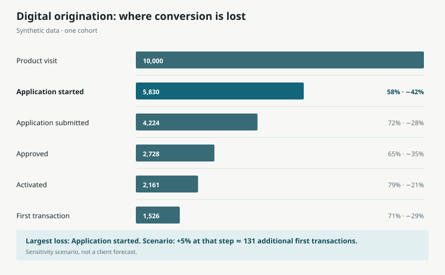

# 06 · Digital conversion funnel

Where does a digital-originations journey lose people, and which transition is
worth testing first?

This case reads an ordered catalog of journey steps and anonymous synthetic
events, then produces one report and the same funnel in English and Spanish.
The chart separates observed counts from a clearly labelled sensitivity
scenario: improving the bottleneck by five percentage points while holding
downstream rates constant.



```bash
uv run --python 3.12 --no-project run.py
```

Outputs:

- `outputs/funnel.svg`
- `outputs/funnel.es.svg`
- `outputs/report.md`

The data is deterministic and synthetic. No client, personal or employer data
is present. This is a reproducible analytical artifact, not evidence that a
specific client achieved the scenario shown.
