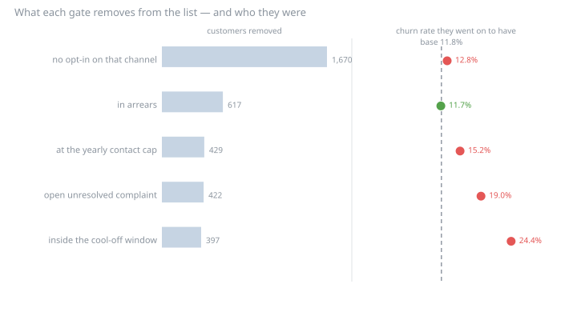

# Customer Intelligence — Reference Implementation

[](https://github.com/GalacticaIA/customer-intelligence-reference/actions/workflows/ci.yml)
[](https://www.python.org/)
[](LICENSE)

Customer-analytics evidence on a single **synthetic, causal, reproducible**
fintech dataset: one data model feeding a series of cases — churn,
next-best-offer, campaign incrementality, actionable segmentation, and the value
work built on top of them.

<p align="center">
  
</p>

<p align="center">
  <em>The governance gates do not remove a random slice: the groups they take out
  churn from 11.7% to 24.4% against a base of 11.8%. That is the finding the whole
  repository exists to make checkable.</em>
</p>

> **Everything here is synthetic.** No client data. The generator is seeded, so
> the CSVs reproduce byte-for-byte from the code in this repository. See
> [`data-model/DATA_CARD.md`](data-model/DATA_CARD.md).

## Why this exists

**Customer & Digital Analytics** is one of the four service lines at
[GalacticaIA](https://galacticaia.com/servicios), and this is its open reference
implementation — what we do, in code you can run, instead of a description of
what we would do.

The hard part in customer intelligence isn't the algorithm. It's the **data model
and the governance around the decision**: churn without leakage, next-best-offer
with consent and eligibility resolved, uplift that isn't confounded by who you
targeted. So the foundation is a dataset built to make those problems real rather
than to make a model look good on them.

That ordering is the firm's position, not a preference: analytics on data with no
owner, no quality and no lineage produces decisions nobody can defend once
someone challenges them. These cases are what it looks like when the foundation
is there.

## The foundation: [`data-model/`](data-model/)

A seeded generator emits 15 related tables with an explicit causal structure, so
the cases are demonstrable rather than circular. The world is a card issuer —
customers on prepaid and credit products, monthly activity, statements and
arrears, support, consent and campaigns — because that is the shape most
customer-intelligence work takes, whatever the industry name on the door. Three
design decisions carry most of the weight:

- The churn label is emitted at **two observation cutoffs**, which is what lets a
  case train on the past and score the future instead of asserting that it did.
- The **contact policy is a table**, not a constant inside whichever script is
  scoring — so a case can report the cost of an individual rule.
- One table is an **answer key**: each customer's outcome had the campaign never
  run. It exists to check estimators and is fenced off from producing any.

See [`data-model/README.md`](data-model/README.md) for the schema, the causal
design and the no-leakage guarantee.

```bash
cd data-model && uv run generate.py    # reproducible CSVs, byte-for-byte by seed
```

Tested on every push: schema, referential integrity, no-leakage, causal signal.

## The cases

Each case is a reproducible pipeline, a visible result and a permanent write-up.

| # | Case | The real problem it shows | Status |
|---|---|---|---|
| 01 | [Actionable segmentation](01-segmentation/) | segments carry behaviour, need, risk, eligible offer, consent and a suggested action — not just RFM clusters | **built** |
| 02 | [Churn without leakage](02-churn-prediction/) | out-of-time split, calibration, explainable drivers, prioritisation by value — accuracy alone isn't success | **built** |
| 03 | [Governed next-best-offer](03-next-best-offer/) | propensity/uplift **and** eligibility, consent, exclusions, contact policy | **built** |
| 04 | ARPU / value decomposition | where revenue per user comes from and moves | planned |
| 05 | [Campaign incrementality](05-campaign-incrementality/) | true uplift vs the confounded naive read, and whether the experiment was big enough to tell | **built** |

**[03 · Governed next-best-offer](03-next-best-offer/)** — the case to read first
if the question is *"does governance slow the business down?"*. It decides who to
contact with which offer, subject to consent, eligibility, exclusions and a
contact policy that lives in the data model rather than in the scoring script.
Findings: the gates **do not remove a random slice** — the groups they take out
churn at anywhere from 11.7% to 24.4% against a base of 11.8% — and the cool-off
window is the most selective rule in the policy, removing the customers who churn
at 24.4%, because they were contacted last quarter *for being* high risk. Governance costs 20% of the plan's
expected value; applying the same rules **in the wrong order** costs 1.8× that
again and silently sends 199 contacts against a capacity of 437. Against the
answer key, a compliant Q1 campaign would have saved 9 customers instead of 39 —
and the loss is **reach**, not response.

**[01 · Actionable segmentation](01-segmentation/)** — the case to read if the
question is *"we already have segments, are they doing anything?"*. It computes
RFM as prescribed and then measures it: on a subscription, recency has **no
variance at all** — one distinct value across the base, because everybody was
invoiced last month — and frequency correlates with tenure at **1.0000**, because
it *is* tenure. Two of the three dimensions are reading the company's own billing
schedule. It then builds the risk-by-value grid, finds three of nine cells worth
a contact, and attacks it: **45% of the base changes cell in six months**, almost
all of it on the risk axis (41.3% against 6.0% for value), while segment *sizes*
move 2.3% — so the dashboard is flat while half the people underneath have
swapped places. Two of its own plays turn out to be refused by the catalogue
rather than by policy, one of them contradicting the definition of the cell it
was written for. Priced against the continuous ranking on the same budget, the
grid loses 9.1%: **rank to choose who, segment to choose what.**

**[02 · Churn without leakage](02-churn-prediction/)** — trains at one cutoff and
scores six months later, then reruns the same model two dishonest ways to show
what each shortcut would have reported: a random split, and one feature derived
from the label (AUC 1.000, nothing errors). Finds that the ranking survives the
time gap but the *calibration* does not, and that re-sorting the same
probabilities by expected value instead of risk changes the contact list by more
than half and the profit by +66% at the same budget.

**[05 · Campaign incrementality](05-campaign-incrementality/)** — reads the
retention campaigns against the control group they held back, four ways: three
comparisons that were never randomised and disagree about even the *sign*, then
the one the control was bought for. Two identically designed campaigns report
"nothing" and "a large, significant save"; the answer key shows both are the same
true effect plus a coin-flip imbalance larger than the effect itself. Settles the
save rate case 02 had to assume — measured 12.4%, interval −4.0% to 28.9%, truth
11.1%, assumed 25% — and finds that the experiment as designed cannot distinguish
any of those from each other, or from zero.

### The cases talk to each other

Each case pays a debt the previous one wrote down, and imports its predecessors
rather than restating them, so they cannot drift apart silently.

- **02 → 05.** Case 02's profit figures applied an *assumed* save rate, because
  whether a contact **caused** a save is unknowable without a control group. Case
  05 measures it, re-prices case 02's contact list from its own scored
  population, and reports what survives — the targeting decision does, the
  business case does not. It imports case 02's feature builder, logistic
  regression and `Economics`.
- **02 and 05 → 03.** Both took their audiences exactly as the campaign built
  them, enforcing neither consent nor eligibility. Case 03 confronts who was
  *allowed* to be contacted, prices its offers with the save rate case 05
  measured rather than the one case 02 assumed, and reads the answer key through
  case 05's quarantined module — so exactly one file in the repository ever
  touches the counterfactual table.

Case 03 also extends the shared data model with the contact policy itself, which
is what lets a case report the cost of an individual rule instead of asserting
that governance is expensive.

## Running it

```bash
cd data-model && uv run generate.py     # the dataset every case reads
cd ../03-next-best-offer && uv run run.py
```

Each case directory holds its own `README.md` with the full method and an
`outputs/` with the charts and the write-up it produced.

## Tests

```bash
uvx pytest tests/ -q
```

---

Built by **GalacticaIA** — a data firm in LATAM, software-agnostic, with
governance as the foundation. Services: [galacticaia.com/servicios](https://galacticaia.com/servicios).
Licensed MIT.
